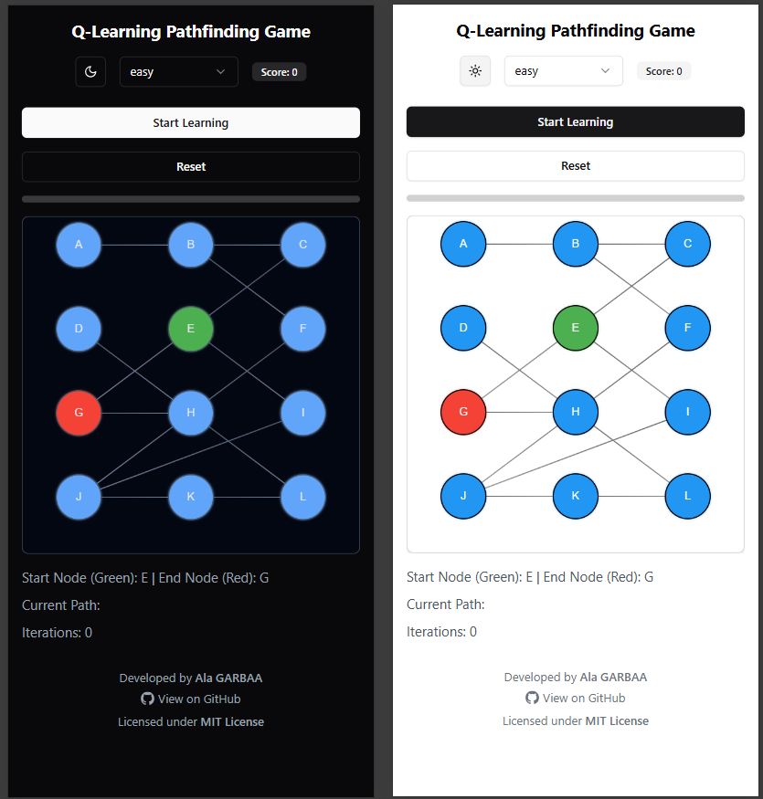

[](https://opensource.org/licenses/MIT)

# Q-Learning Pathfinding Visualizer using Svelte5

An interactive visualization tool demonstrating the Q-Learning algorithm for pathfinding using SvelteKit and Canvas.



##  Getting Started

1. Clone the repository:

```bash
git clone https://github.com/ala-garbaa-pro/svelte5-q-learning.git
cd svelte5-q-learning && code .
pnpm install
pnpm run dev
```

##  Overview

This project provides an intuitive and visual way to understand how Q-Learning, a fundamental reinforcement learning algorithm, works in the context of pathfinding. Users can watch the AI agent learn optimal paths between nodes in real-time with engaging visual and audio feedback.

## ✨ Features

-  Interactive graph visualization
-  Real-time learning process animation
-  Sound effects for enhanced user experience
-  Progress tracking and score system
- ️ Multiple difficulty levels
-  Smooth animations and visual effects
-  Clean and modern UI using shadcn-svelte

## 🛠️ Technologies Used

[](https://kit.svelte.dev/)
[](https://www.typescriptlang.org/)
[](https://vitejs.dev/)
[](https://tailwindcss.com/)
[](https://www.shadcn-svelte.com/)

## 📖 Usage Guide

1. **Start the Application**
   - Run `pnpm run dev` to start the development server
   - Navigate to `http://localhost:5173` in your browser

2. **Using the Visualizer**
   - Click on the canvas to create nodes
   - Use the control panel to adjust learning parameters
   - Press "Start Learning" to begin the visualization
   - Watch as the agent learns optimal paths between nodes

3. **Adjusting Settings**
   - Learning Rate: Controls how quickly the agent learns
   - Exploration Rate: Determines random vs. learned actions
   - Speed: Adjust the animation speed
   - Sound: Toggle sound effects on/off

## 🤝 Contributing Guidelines

Contributions are always welcome! Here's how you can help:

1. Fork the repository
2. Create a new branch (`git checkout -b feature/improvement`)
3. Make your changes
4. Run tests if available
5. Commit your changes (`git commit -am 'Add new feature'`)
6. Push to the branch (`git push origin feature/improvement`)
7. Create a Pull Request

Please make sure to:
- Follow the existing code style
- Add comments for complex logic
- Update documentation as needed
- Test your changes thoroughly

## 🙏 Attribution

Made with ❤️ by [Ala GARBAA](https://github.com/ala-garbaa-pro)

If you use this project, please provide attribution by linking back to this repository.

## 📄 License

This project is licensed under the MIT License - see the [LICENSE](LICENSE) file for details.


MIT License
